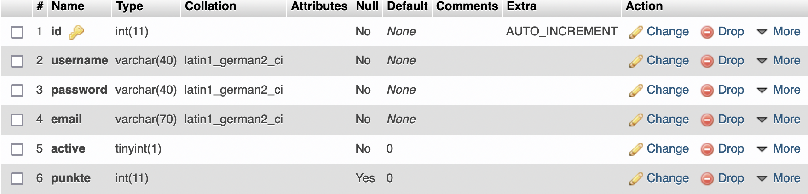

# social-network
A social network

## Requirements
- MySQL database
- PHP webserver

## Important information
This project is only a proof of concept and not designed to be used in a productive environment.
For instance, it lacks basic security features (e.g., password salting, protection against mysql injection).

## Instructions
1. Set up database structure (see file `create_db.sql` and configure database access in `connect.php`
2. Register an account and log in afterwards to explore the full functionality

### Database structure
